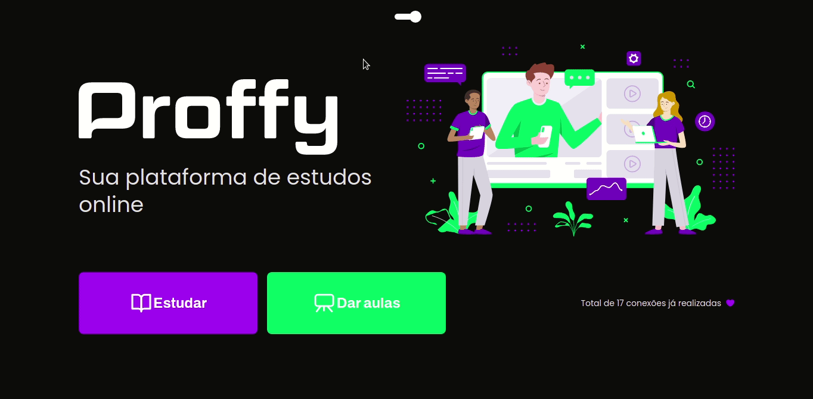

<p align="center">
  

  

  <a href="https://github.com/tgmarinho/README-ecoleta/commits/master">
    
  </a>

   

   
</p>
<h1 align="center" style="font-weight: bold"> 📚 Proffy 📚</h1>
<h1 align="center">
    
</h1>

<h4 align="center">
	🚧 Em desenvolvimento 🚧
</h4>

<!-- <h3 align="center"> <a href="https://trutaa-landingpage.vercel.app/">Acessar Landing Page do projecto</a> </h3> -->

---
## Índice:
<!--ts-->
   * [Sobre](#-sobre-o-projeto)
   * [Features](#-features)
   * [Tecnologias](#-tecnologias)
   * [Como executar o projeto](#-como-executar-o-projeto)
      * [Pré-requisitos](#-pré-requisitos)
      * [Rodando o projecto](#-rodando-o-projeto)
   * [Autor](#-autor)
   * [Licença](#-licença)
   * [Versões do ReadMe](#-versões-do-readme)
        * [Português](./README-pt.md)
        * [Inglês](./README.md)
<!--/ts-->
<!--te-->
---
## 💻 Sobre o projeto

<p>
    Projeto feito para conectar professores e estudantes, feito na Next Level Week #2 @Rocketseat
</p>

---
## 📋 Features
- [x] Cadastro de estudantes
- [x] Cadastro de professores

---
## 🛠 Tecnologias
<p>As seguintes ferramentas foram usadas na construção do projecto:</p>

<li><a href="https://www.typescriptlang.org/">TypeScript</a></li>
<li><a href="https://reactjs.org/">React</a></li>
<li><a href="https://expressjs.com/">Express</a></li>
<li><a href="https://www.sqlite.org/">SQLite 3</a></li>

---
## 🚀 Como executar o projeto
---
### ✅ Pré-requisitos:

<li><a href="https://git-scm.com">Git</a></li>
<li><a href="https://nodejs.org/en/">Node.js</a></li>
<li><a href="https://www.sqlite.org/">SQLite 3</a></li>
<p>Além disto é bom ter um editor para trabalhar com o código como o <a href="https://code.visualstudio.com/">Visual Studio Code (VSCode)</a> </p>

---
### 🎲 Rodando o projecto
---

#### Clone o repositório
```bash
git clone https://github.com/EvandroSilvaProgrammer/proffy-web.git
```
---
### 🎲 Rodando a API
#### Acesse a pasta do projeto no terminal/cmd
```bash
cd proffy-web/api
```

#### Instale as dependências
```bash
yarn
```
#### ou
```bash
npm install
```

#### Execute a aplicação em modo de desenvolvimento
```bash
yarn start
```
---

### 🎲 Rodando a aplicação WEB
#### Acesse a pasta do projeto no terminal/cmd
```bash
cd proffy-web
```

#### Instale as dependências
```bash
yarn
```
#### ou
```bash
npm install
```

#### Execute a aplicação em modo de desenvolvimento
```bash
yarn start
```
---

## 🦸 Autor

<a href="https://github.com/EvandroSilvaProgrammer">
 
 <br />
 <sub><b>Evandro Silva AKA SkeBug</b></sub></a> <a href="https://github.com/EvandroSilvaProgrammer" title="EvandroSilva">🇦🇴</a>
 <br /> <br />

[](https://www.linkedin.com/in/evandrosilva-programmer/)

[](https://www.facebook.com/evandrosilva.programmer)

[](mailto:evandrosilva.programmer@gmail.com)

---
## 📝 Licença

Este projeto esta sobe a licença [MIT](./LICENSE).

Feito com ❤️ por Evandro Silva AKA SkeBug 👋🏽 [Entre em contato!](https://www.linkedin.com/in/evandrosilva-programmer/)

---

##  Versões do README

[Português 🇦🇴](./README-pt.md)  |  [Inglês 🇺🇸](./README.md)
