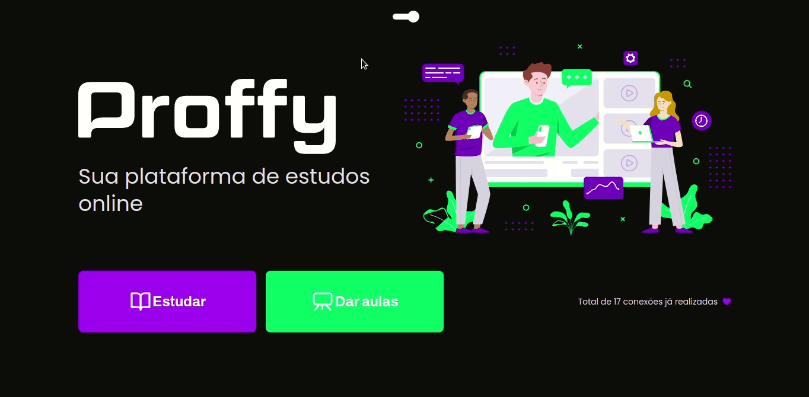

<p align="center">
  

  

  <a href="https://github.com/tgmarinho/README-ecoleta/commits/master">
    
  </a>

   

   
</p>
<h1 align="center" style="font-weight: bold"> 📚 Proffy 📚</h1>
<h1 align="center">
    
</h1>

<h4 align="center">
	🚧 Developing 🚧
</h4>

<!-- <h3 align="center"> <a href="https://trutaa-landingpage.vercel.app/">Acessar Landing Page do projecto</a> </h3> -->

---
## Index:
<!--ts-->
   * [About](#-about-the-project)
   * [Features](#-features)
   * [Technologies](#-technologies)
   * [How to run the project](#-how-to-run-the-project)
      * [Prerequisites](#-pré-requisitos)
      * [Runing the project](#-runing-the-project)
   * [Author](#-author)
   * [License](#-license)
   * [ReadMe versions](#-readme-versions)
        * [Português](./README-pt.md)
        * [English](./README.md)
<!--/ts-->
<!--te-->
---
## 💻 About the project

<p>
    Project made to connect teachers and students, made at Next Level Week #2 @Rocketseat
</p>

---
## 📋 Features
- [x] Student registration
- [x] Teacher registration

---
## 🛠 Technologies
<p>The following tools were used in the construction of the project:</p>

<li><a href="https://www.typescriptlang.org/">TypeScript</a></li>
<li><a href="https://reactjs.org/">React</a></li>
<li><a href="https://expressjs.com/">Express</a></li>
<li><a href="https://www.sqlite.org/">SQLite 3</a></li>

---
## 🚀 How to run the project
---
### ✅ Prerequisites:

<li><a href="https://git-scm.com">Git</a></li>
<li><a href="https://nodejs.org/en/">Node.js</a></li>
<li><a href="https://www.sqlite.org/">SQLite 3</a></li>
<p>Besides, it's good to have an editor to work with code like <a href="https://code.visualstudio.com/">Visual Studio Code (VSCode)</a> </p>

---
### 🎲 Runing the project:
---

#### Clone the repository
```bash
git clone https://github.com/EvandroSilvaProgrammer/proffy-web.git
```
---
### 🎲 Run API
#### Access the project folder in terminal/cmd
```bash
cd proffy-web/api
```

#### Install the dependencies
```bash
yarn
```
#### ou
```bash
npm install
```

#### Run the application in development mode
```bash
yarn start
```
---

### 🎲 Run web aplication
#### Access the project folder in terminal/cmd
```bash
cd proffy-web
```

#### Install the dependencies
```bash
yarn
```
#### ou
```bash
npm install
```

#### Run the application in development mode
```bash
yarn start
```
---

#### 🦸 Author

<a href="https://github.com/EvandroSilvaProgrammer">
 
 <br />
 <sub><b>Evandro Silva AKA SkeBug</b></sub></a> <a href="https://github.com/EvandroSilvaProgrammer" title="EvandroSilva">🇦🇴</a>
 <br /> <br />

[](https://www.linkedin.com/in/evandrosilva-programmer/)

[](https://www.facebook.com/evandrosilva.programmer)

[](mailto:evandrosilva.programmer@gmail.com)

---

## 📝 License

This project is under license [MIT](./LICENSE).

Made with ❤️ by Evandro Silva AKA SkeBug 👋🏽 [Get int touch!](https://www.linkedin.com/in/evandrosilva-programmer/)

